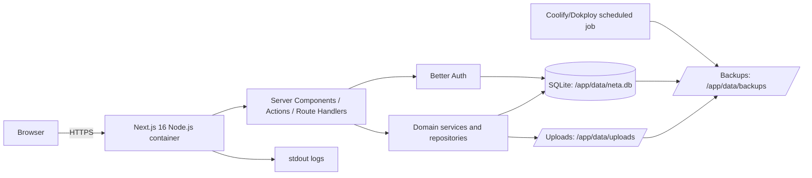
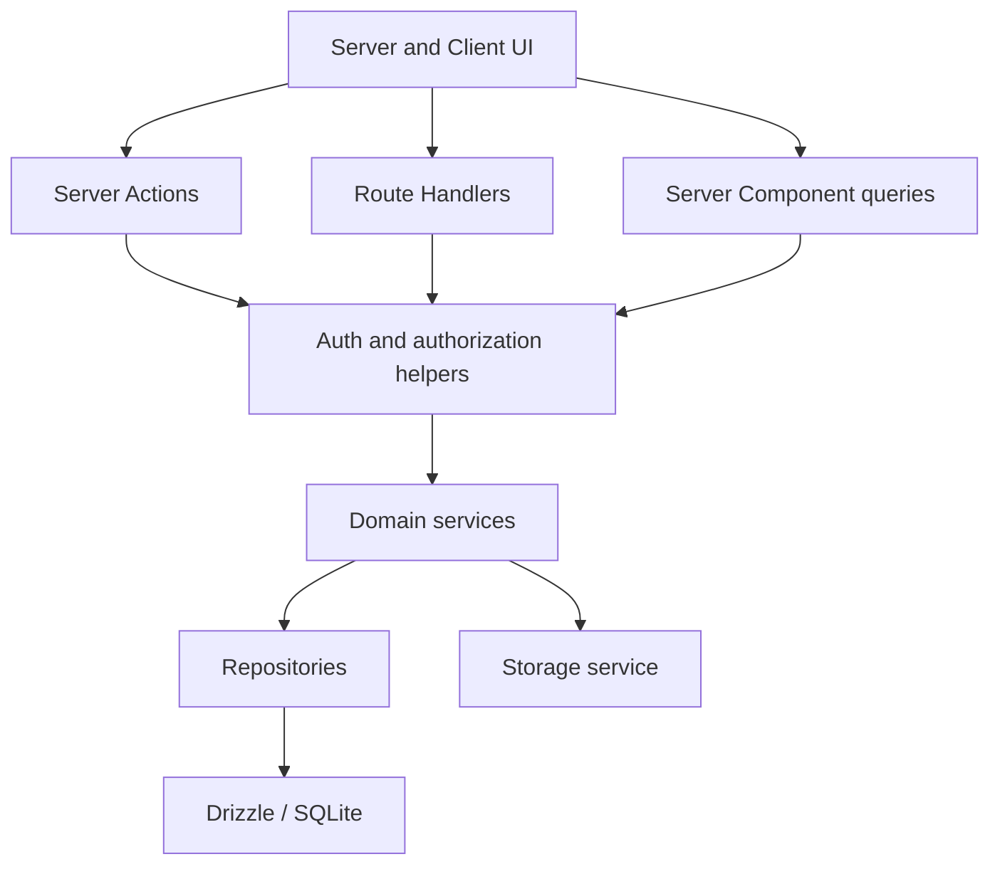

# Neta Self-Hosted Redesign Planı

## 1. Dokümanın amacı

Bu doküman, mevcut Neta uygulamasını çalışan ürünü bozmadan aşağıdaki hedef mimariye taşımak için uygulanabilir ana plandır:

- Supabase Auth, Postgres, Storage, RLS ve RPC bağımlılıklarını tamamen kaldırmak.
- Tüm backend davranışını Next.js'in server tarafında toplamak.
- Tek kullanıcı veya küçük ekip ölçeğindeki freelancer iş yükü için gömülü SQLite kullanmak.
- Poyraz UI bağımlılığını kaldırıp Neta'nın sahip olduğu bir arayüz sistemi oluşturmak.
- Dokploy, Coolify veya standart Docker çalıştırıcısında tek uygulama ve tek kalıcı volume ile deploy edebilmek.
- Mevcut performans, tutarlılık, güvenlik ve kullanıcı deneyimi problemlerini yeni mimariye taşımamak.
- Supabase üzerindeki mevcut veriyi doğrulanabilir ve geri alınabilir bir süreçle yeni sisteme aktarabilmek.

Bu çalışma bir paket değiştirme operasyonu değildir. Supabase bugün aynı anda kimlik doğrulama, yetkilendirme, veritabanı, dosya depolama, trigger, aggregate RPC ve kullanıcı oluşturma işlerini yürütmektedir. Başarılı geçiş, bu sorumlulukların her biri için açık bir yeni sahip tanımlamayı gerektirir.

Faz sonu kontrolleri [19-self-hosted-redesign-checklist.md](./19-self-hosted-redesign-checklist.md) dosyasında tutulacaktır.

## 2. Yönetici özeti ve önerilen karar

Önerilen üretim topolojisi tek bir Node.js 22 konteyneridir. Uygulama Next.js 16 App Router ile çalışır; Drizzle ORM üzerinden `better-sqlite3` kullanır; veritabanı ile yüklenen dosyalar aynı kalıcı volume altında saklanır. Kimlik doğrulama Better Auth tarafından aynı SQLite veritabanında yönetilir. Arayüz, Neta'ya ait `components/ui` bileşenleri ve semantik tasarım token'ları üzerinden kodlanır.

Önerilen temel kararlar:

| Alan | Karar | Gerekçe |
| --- | --- | --- |
| Veritabanı | SQLite + `better-sqlite3` | Tek instance freelancer iş yükünde düşük gecikme, ayrı DB servisi gerektirmeme ve kolay yedekleme |
| ORM/migration | Drizzle ORM + Drizzle Kit | Type-safe sorgu, kaynak kontrollü SQL migration ve düşük çalışma zamanı yükü |
| Auth | Better Auth, e-posta/parola, DB session | Harici auth servisi olmadan güvenli session yönetimi; auth protokolünü sıfırdan yazmama |
| Yetkilendirme | Server-side policy/helper + sahiplik filtreli repository | SQLite'ta RLS yok; güvenlik her sorgunun server bağlamında uygulanmalı |
| Dosyalar | Yerel disk + metadata tablosu + yetkili Route Handler | S3/Supabase Storage olmadan tek volume ile çalışma |
| UI | Neta'nın kendi bileşen API'si ve stilleri | Marka ve UX kontrolü; Poyraz UI kaldırılabilirliği |
| Erişilebilir davranış | Gerekli karmaşık widget'larda tek bir headless primitive katmanı | Dialog/select/menu gibi bileşenlerde klavye, focus ve ARIA davranışını güvenli tutma |
| Deploy | Multi-stage Docker, Next.js `output: standalone`, tek volume | Coolify/Dokploy için tek servis ve tekrarlanabilir image |
| Ölçek modeli | Tek çalışan instance | SQLite aynı dosyayı kullanan yatay replica modeli için uygun değildir |
| Eski üretim | Redesign tamamlanana kadar Supabase sürümü çalışmaya devam eder | Dual-write ve yarım taşınmış üretim riskini önleme |

Bu kararın önemli sınırı şudur: hedef sürüm aynı anda yalnızca bir Neta uygulama instance'ı çalıştırır. Yatay çoğaltma, paylaşımlı ağ dosya sistemi veya yoğun eşzamanlı yazma ihtiyacı doğarsa veritabanı adaptörü PostgreSQL'e geçirilmelidir. Bu sınır gizlenmemeli; deploy dokümanında açıkça yazılmalıdır.

## 3. Mevcut durum analizi

### 3.1 Teknik yüzey

Mevcut repo incelemesinde:

- 44 uygulama dosyası Supabase paketlerine veya `lib/supabase` yardımcılarına bağlıdır.
- 36 uygulama/CSS dosyası doğrudan `poyraz-ui` kullanmaktadır.
- Browser Supabase client özellikle sohbet ve ayarlar ekranında doğrudan auth/veri işlemi yapmaktadır.
- Server Components sayfa verisini, Server Actions mutation'ları, Route Handlers ise AI ve kullanıcı oluşturma işlemlerini yürütmektedir.
- Ayrı bir backend uygulaması yoktur; bu, hedef Next.js server-side mimarisi için iyi bir başlangıçtır.
- `lib/db.ts` içindeki Dexie/IndexedDB katmanı aktif akışlarda kullanılmamaktadır ve eski bir prototip kalıntısıdır.
- Dockerfile, Compose, otomatik migration runner, backup/restore komutu ve test altyapısı bulunmamaktadır.
- Production build başarılıdır; lint tabanı temiz değildir ve mevcut incelemede 34 hata ile 25 uyarı üretmiştir.

### 3.2 Supabase'in bugün üstlendiği sorumluluklar

Supabase kaldırıldığında aşağıdaki işlerin her biri yeniden uygulanmalıdır:

1. Kullanıcı kaydı, parola doğrulama, session cookie ve çıkış.
2. İlk freelancer/admin hesabı oluşturulduktan sonra herkese açık kaydı kilitleme.
3. Freelancer tarafından müşteri portal hesabı oluşturma.
4. `freelancer` ve `client` rol ayrımı.
5. Her kaydı `user_id` ile izole eden RLS politikaları.
6. Müşterinin yalnızca kendi projelerini, public görevleri ve revizyonlarını görmesi.
7. PostgreSQL tabloları, foreign key'ler, check constraint'ler ve trigger'lar.
8. Dashboard ve analytics aggregate RPC'leri.
9. Avatar ve proje görseli depolama, dosya limiti ve signed URL üretimi.
10. `pgvector` tabanlı embedding saklama ve benzerlik araması.
11. Service-role ile ayrıcalıklı kullanıcı/dosya operasyonları.

Yeni sistemde service-role anahtarı veya browser DB client olmayacaktır. Ayrıcalık, yalnızca server tarafında çalışan ve session/rol kontrolü yapan servis fonksiyonlarıyla temsil edilecektir.

### 3.3 Mevcut veri alanları

Aktif veya tarihsel şemada şu iş alanları bulunur:

- Kimlik/profil: `profiles` ve Supabase `auth.users`.
- İş yönetimi: `clients`, `projects`, `tasks`, `calendar_events`.
- Proje çalışma alanı: `project_planning_sections`, `project_revisions`, proje kapak görselleri.
- Finans: `finance_transactions`, `invoices`, `proposals`, `contracts`, `subscriptions`.
- CRM: `client_activities`, pipeline ve takip alanları.
- Günlük: aktif ekranda `daily_logs`, eski şemada `journals`.
- AI: `chat_sessions`, `chat_messages`, `app_settings`, `document_embeddings`.

`journals` ile `daily_logs`, `completed` ile `done`, planlama alanındaki `category` ile bazı UI kodundaki `type` gibi tarihsel tutarsızlıklar vardır. Yeni şema mevcut SQL'i körlemesine kopyalamamalı; önce kanonik sözlük belirlenmelidir.

### 3.4 Kopyalanmaması gereken mevcut problemler

Geçiş sırasında aşağıdaki problemler davranış paritesi olarak kabul edilmeyecektir:

- Portal proje detayında `sort_order` yerine var olmayan `order_index` ile sıralama.
- Proje risk analizinde bitmiş görev için `done` yerine `completed` kontrolü.
- Portal planlama UI'ında `category` yerine `type` alanı okuma.
- Revizyon kotasının yalnızca UI'da kontrol edilip server action içinde zorunlu tutulmaması.
- Mevcut portal revizyon insert politikasında proje ile müşteri ilişkisinin tam doğrulanmaması.
- Liste ekranlarında sınırsız kayıt çekme, gereksiz `select("*")` ve istemciye fazla veri gönderme.
- Bazı mutation'larda pending, optimistic update, rollback veya hata mesajı olmaması.
- Browser component'lerinin doğrudan veritabanı/auth SDK'sına erişmesi.
- AI provider anahtarının veritabanında düz metin tutulması ve istemciye geri okunması.

## 4. Hedefler, başarı ölçütleri ve kapsam dışı işler

### 4.1 Ürün hedefleri

- Bir freelancer, repo URL'si, birkaç secret ve tek persistent volume ile Neta'yı ayağa kaldırabilmelidir.
- Kurulum ekranı ilk freelancer hesabını oluşturmalı ve ardından public registration kapanmalıdır.
- Müşteri portalı davet bağlantısıyla kurulabilmeli; adminin parola üretip paylaşmasına gerek kalmamalıdır.
- En sık işler olan görev tamamlama, proje açma, müşteri bulma, gelir/gider ekleme ve takvim kontrolü az tıklama ve anlık geri bildirimle yürümelidir.
- UI; dashboard kartlarının toplamından ziyade günlük iş akışını, yaklaşan işleri ve nakit durumunu önceliklendirmelidir.

### 4.2 Teknik başarı ölçütleri

- Üretim için Supabase URL'si, anon key'i veya service-role key'i gerekmemesi.
- Üretim için ayrı PostgreSQL, Redis, S3 veya auth servisi gerekmemesi.
- Tek image ve tek volume ile temiz kurulumun otomatik tamamlanması.
- Tüm migration'ların kaynak kontrolünde bulunması ve boş veritabanına deterministik uygulanması.
- `lint`, typecheck, unit/integration test, production build ve Docker smoke testlerinin temiz geçmesi.
- Yetkisiz kullanıcı/portal erişimini kapsayan negatif entegrasyon testlerinin bulunması.
- Dashboard sıcak DB sorgu süresinin referans veri setinde hedef olarak 50 ms altında; mutation DB bölümünün 100 ms altında olması.
- Kullanıcı tıklamasından pending feedback'e kadar geçen sürenin 100 ms altında olması.
- Liste sorgularının pagination veya sınırlı tarih aralığı kullanması; veri arttıkça payload'ın doğrusal büyümemesi.
- Yedek alma ve boş bir kurulumda geri yükleme tatbikatının belgelenmiş ve başarılı olması.

Performans hedefleri referans donanım ve veri setiyle ölçülmelidir. Ağ TTFB'si ile saf DB süresi birbirinden ayrı raporlanacaktır.

### 4.3 Kapsam dışı işler

İlk self-hosted sürümde aşağıdakiler hedeflenmez:

- Birden fazla Next.js replica veya Kubernetes horizontal scaling.
- Birden fazla freelancerın aynı workspace içinde ekip olarak çalışması.
- Gerçek zamanlı collaborative editing veya websocket tabanlı presence.
- Harici object storage zorunluluğu.
- Tam offline-first veri senkronizasyonu.
- Supabase password hash veya aktif session taşıma.
- Gelişmiş vector database/RAG altyapısı.
- Native mobil uygulama.

Bu sınırlar veri modelinin gelecekte genişlemesini engellememeli, ancak bugünkü tasarımı gereksiz soyutlamalarla ağırlaştırmamalıdır.

## 5. Hedef mimari

### 5.1 Çalışma zamanı topolojisi



Tek kalıcı volume içeriği:

```text
/app/data/
  neta.db
  neta.db-wal
  neta.db-shm
  uploads/
    avatars/
    project-assets/
  backups/
  tmp/
```

`-wal` ve `-shm` dosyaları normal çalışma zamanı dosyalarıdır. Elle kopyalanarak tutarlı yedek alınmamalıdır; SQLite backup API veya kontrollü checkpoint kullanılmalıdır.

### 5.2 Uygulama katmanları



Kurallar:

- Client Component hiçbir zaman DB, auth secret veya filesystem modülü import etmez.
- Server Components yalnızca query/service fonksiyonlarına erişir; tablo detaylarını sayfa içine yaymaz.
- Server Actions form mutation'ları ve küçük etkileşimler için kullanılır.
- Route Handlers auth endpoint'i, AI streaming, dosya upload/download, export ve health check için kullanılır.
- Repository yalnızca veri erişiminden; service ise iş kuralları, transaction sınırı ve yetkilendirmeden sorumludur.
- Aynı iş kuralı hem Server Action hem Route Handler tarafından çağrılıyorsa service içinde tek kez tanımlanır.

### 5.3 Önerilen klasör yapısı

```text
app/
  (auth)/
  (dashboard)/
  portal/
  api/
components/
  ui/                 # Neta'nın sahip olduğu primitive bileşenler
  layout/
features/
  clients/
  projects/
  tasks/
  calendar/
  finance/
  business/
  journal/
  analytics/
  chat/
  portal/
server/
  auth/
    auth.ts
    session.ts
    authorization.ts
  db/
    client.ts
    schema/
    migrations/
    queries/
  repositories/
  services/
  storage/
  security/
  observability/
shared/
  contracts/
  validation/
  formatting/
scripts/
  migrate.mjs
  seed.mjs
  backup.mjs
  restore.mjs
  import-supabase.mjs
```

Bu yapı bir kerede taşınmamalıdır. Bir feature yeni katmana geçtiğinde o feature'ın eski Supabase sorgusu silinir; yarım feature iki veri yolunu aynı anda kullanmaz.

## 6. Temel teknik kararlar

### 6.1 SQLite ve `better-sqlite3`

SQLite seçimi şu kullanım profiline uygundur:

- Tek kurulumda bir freelancer ve sınırlı sayıda portal kullanıcısı.
- Okuma ağırlıklı dashboard/liste ekranları.
- Kısa transaction'larla yapılan düşük eşzamanlı yazma.
- Operasyon kolaylığının yatay ölçekten önemli olması.

Uygulama başlangıcında bağlantı şu PRAGMA'ları kontrollü biçimde ayarlamalıdır:

```sql
PRAGMA foreign_keys = ON;
PRAGMA journal_mode = WAL;
PRAGMA synchronous = NORMAL;
PRAGMA busy_timeout = 5000;
```

Ek kurallar:

- Uygulama process'i başına tek DB bağlantı nesnesi oluşturulur; development hot reload için global singleton korunur.
- Migration HTTP isteği içinde çalıştırılmaz; container server başlamadan önce uygulanır.
- Transaction içinde AI API çağrısı, dosya upload'ı veya başka uzun I/O yapılmaz.
- Yazma transaction'ları kısa tutulur.
- SQLite dosyası NFS/SMB gibi paylaşımlı ağ volume'unda çalıştırılmaz; yerel persistent block storage kullanılır.
- Coolify/Dokploy replica sayısı daima `1` olur; rolling deployment yerine stop/start veya recreate stratejisi kullanılır.
- `SQLITE_BUSY` hataları loglanır ve kontrollü kısa retry yalnızca idempotent operasyonlarda uygulanır.

### 6.2 Drizzle schema ve migration modeli

- TypeScript schema kaynak gerçeğidir; migration SQL dosyaları commit edilir.
- Şema değişikliği `generate` ile üretilir, SQL insan tarafından gözden geçirilir ve ardından uygulanır.
- Production'da `push` kullanılmaz.
- Migration'lar forward-only kabul edilir. Geri dönüş, migration öncesi yedekten restore ile yapılır.
- Container başlangıcında migration lock ve tek-instance koşulu doğrulanır.
- Migration dosyaları standalone image içine açıkça kopyalanır.
- CI her migration setini sıfır SQLite dosyasına ve bir önceki release fixture'ına uygular.

Planlanan komutlar:

```text
npm run db:generate
npm run db:migrate
npm run db:check
npm run db:seed
npm run db:studio       # yalnızca local development
```

### 6.3 Kimlik doğrulama ve session

Better Auth, email/password ve veritabanı session modeliyle kullanılacaktır. Better Auth'ın ürettiği auth tabloları manuel tahmin edilmek yerine CLI/schema çıktısıyla migration setine dahil edilir.

Auth akışları:

1. Boş kurulumda `/setup` açılır.
2. Server, freelancer rolünde kullanıcı bulunmadığını transaction içinde doğrular.
3. İlk kullanıcı oluşturulur ve public setup kalıcı olarak kapanır.
4. Sonraki kullanıcılar yalnızca freelancerın ürettiği süreli portal davetiyle kayıt olabilir.
5. Davet token'ının yalnızca hash'i DB'de saklanır; ham token URL'de bir kez kullanılır.
6. Parola değiştirme mevcut session ve eski session'ları iptal etme seçeneğiyle yapılır.
7. Session cookie `HttpOnly`, production'da `Secure` ve uygun `SameSite` değeriyle tutulur.

Gerekli environment secret'ları:

- `BETTER_AUTH_SECRET`: en az 32 karakter, yüksek entropili.
- `APP_URL`: canonical origin.
- `TRUSTED_ORIGINS`: gerekiyorsa açık origin listesi; wildcard yok.
- `APP_ENCRYPTION_KEY`: saklanan AI API anahtarlarını şifrelemek için ayrı anahtar.

Proxy/middleware yalnızca kullanıcı deneyimi amaçlı hızlı yönlendirme yapabilir. Asıl session ve rol kontrolü her korumalı layout, Server Action, Route Handler ve service girişinde yeniden yapılır. Cookie varlığı hiçbir zaman yetkilendirme kanıtı sayılmaz.

### 6.4 Yetkilendirme: RLS yerine uygulama politikası

SQLite RLS sağlamadığı için güvenlik modeli açıkça kodlanmalıdır:

```text
requireSession()
requireFreelancer()
requireClientUser()
requireOwnedClient(clientId)
requireOwnedProject(projectId)
requirePortalProjectAccess(projectId)
```

Repository sorgularında temel kural:

```text
Kötü:  WHERE id = :resourceId
Doğru: WHERE id = :resourceId AND owner_id = :sessionUserId
```

Portal sorgusu ise hem portal kullanıcı-client bağını hem de kaynak-client bağını aynı sorguda doğrular. Kaynağı önce ID ile çekip sonra UI tarafında kontrol etmek kabul edilmez.

Her mutation için:

1. Input Zod ile parse edilir.
2. Session alınır.
3. Rol ve sahiplik doğrulanır.
4. İş kuralı doğrulanır.
5. Gerekirse transaction açılır.
6. Mutation uygulanır.
7. Audit/log kaydı yazılır.
8. İlgili route/tag revalidate edilir.
9. Tipli sonuç döndürülür.

### 6.5 Yerel dosya depolama

Supabase Storage yerine aşağıdaki model kullanılır:

- Dosyanın binary içeriği `DATA_DIR/uploads` altında tutulur.
- DB'de `files` tablosu; `id`, `owner_id`, `kind`, `storage_key`, `original_name`, `mime_type`, `size_bytes`, `sha256`, `created_at` ve ilişkili resource bilgisini taşır.
- DB'ye absolute path yazılmaz.
- Kullanıcı tarafından gönderilen dosya adı disk path'i olarak kullanılmaz.
- Dosya uzantısı ve MIME yalnızca header'a güvenmeden doğrulanır.
- Avatar ve proje görselleri için boyut ve MIME allowlist uygulanır.
- Yazma önce geçici dosyaya yapılır; doğrulama sonrası atomik rename kullanılır.
- DB kaydı başarısız olursa dosya temizlenir; dosya yazımı başarısız olursa DB kaydı oluşturulmaz.
- Yetkili dosya Route Handler'ı DB sahiplik kontrolünden sonra stream eder.
- Private dosyalarda tahmin edilebilir doğrudan filesystem URL'si verilmez.

İlk hedef yalnızca avatar ve proje kapak görselidir. Genel doküman yönetimi ayrı ürün fazıdır.

### 6.6 UI bağımlılık stratejisi

“Kendi UI'ımız” şu şekilde yorumlanacaktır:

- Neta; bileşen API'sine, HTML yapısına, token'lara, stillere, varyantlara ve UX kararlarına sahip olur.
- Feature dosyaları üçüncü taraf görsel component import etmez.
- Dialog, select, dropdown, tooltip ve toast gibi erişilebilirlik açısından karmaşık davranışlarda yalnızca headless primitive kullanılabilir.
- Headless katman tek bir paketle sınırlandırılır ve yalnızca `components/ui` içinden import edilir.
- Lucide ikonlar korunur; ikinci bir ikon seti kullanılmaz.

Önerilen bağımlılık temizliği:

| Kategori | Plan |
| --- | --- |
| `poyraz-ui` | Tamamen kaldır |
| `@supabase/ssr`, `@supabase/supabase-js` | Runtime'dan tamamen kaldır |
| Dexie paketleri ve `lib/db.ts` | Offline sync kapsam dışıysa kaldır |
| `shadcn` CLI/runtime paketi | Üretim dependency'sinden kaldır |
| Tekil Radix paketleri + `radix-ui` tekrarları | Tek headless yaklaşımına indir |
| `@iconify/react` | Tüm ikonlar Lucide'a taşındıktan sonra kaldır |
| `uuid` | `crypto.randomUUID()` yeterliyse kaldır |
| `framer-motion` | Ölçülmüş bir ihtiyaç yoksa CSS transition'a indir ve kaldır |
| `@ducanh2912/next-pwa` | İlk hedef sürümde kaldır; PWA değeri ayrıca kanıtlanırsa geri ekle |
| Drizzle, Better Auth, `better-sqlite3` | Yerel runtime temel bağımlılığı olarak ekle |

Paket sayısını azaltmak tek başına amaç değildir. Harici servis zorunluluklarını kaldırmak ve kalan paketlerin net bir sorumluluğu olmasını sağlamak asıl ölçüttür.

### 6.7 PWA ve offline davranışı

Mevcut uygulamada gerçek bir offline mutation/sync modeli yoktur. Bu nedenle ilk redesign release'inde:

- PWA service worker kaldırılır.
- Dexie kaldırılır.
- Tarayıcıda stale auth veya eski dashboard verisi üretebilecek cache davranışı ortadan kaldırılır.
- İhtiyaç doğrulanırsa sonraki fazda yalnızca installable shell ve static asset cache geri eklenir.
- API, auth, portal ve kullanıcı verisi network-only kalır.

## 7. Hedef veri modeli

### 7.1 Veri tipi standartları

- ID: SQLite `TEXT`, mevcut UUID'ler korunur, yeni ID için `crypto.randomUUID()`.
- Timestamp: UTC epoch millisecond tutan `INTEGER`; API/UI sınırında `Date` dönüşümü.
- Sadece gün ifade eden alan: `YYYY-MM-DD` biçiminde `TEXT`.
- Boolean: Drizzle `integer(..., { mode: "boolean" })`.
- Para: `amount_minor INTEGER` + ISO 4217 `currency TEXT`; JavaScript floating point para hesabı yapılmaz.
- Yüzde/oran: amaca göre integer basis point veya açıkça belgelenmiş numeric ölçek.
- JSON: SQLite `TEXT` JSON mode ve parse sınırında schema doğrulama.
- Enum benzeri alan: TypeScript union + DB `CHECK` constraint.
- Tüm mutable tablolarda `created_at` ve `updated_at`.

Mevcut `numeric(12,2)` değerleri import sırasında iki ondalık desteklenen para birimleri için minor unit'e çevrilir. Farklı exponent gerektiren para birimleri desteklenecekse conversion tablosu migration başlamadan tanımlanır.

### 7.2 Auth ve erişim tabloları

- Better Auth tarafından üretilen user/session/account/verification tabloları.
- `profiles`: user ile bire bir; görünen ad, avatar file ID, locale, timezone ve `freelancer|client` rolü.
- `portal_invitations`: client, davet eden freelancer, token hash, son kullanma, kullanıldı zamanı.
- `audit_events`: kritik auth, import, settings ve portal olayları için küçük append-only kayıt.

`clients.portal_user_id`, portal kullanıcısını ilgili müşteri kaydına bağlar. Bir portal user yalnızca bir client kaydına bağlı olacaksa unique constraint ile zorlanır.

### 7.3 Domain tabloları

İlk hedef şema, mevcut aktif davranışı koruyarak aşağıdaki tabloları içerir:

- `clients`
- `client_activities`
- `projects`
- `project_planning_sections`
- `tasks`
- `calendar_events`
- `project_revisions`
- `finance_transactions`
- `proposals`
- `contracts`
- `invoices`
- `subscriptions`
- `journal_entries`
- `chat_sessions`
- `chat_messages`
- `app_settings`
- `files`

`owner_id`, kaydın freelancer sahibini gösterir. `portal_user_id` veya `requested_by_user_id` sahiplik yerine aktörü gösterir. İki kavram karıştırılmaz.

### 7.4 Günlük verisinin birleştirilmesi

Mevcut `journals` ve `daily_logs` tek `journal_entries` modelinde birleştirilir:

- `entry_type`: `daily_checkin` veya `journal`.
- `entry_date`.
- `content`.
- `mood_label`, `mood_score`, `energy_score`, `work_satisfaction_score` nullable alanları.
- Gerekliyse AI summary/sentiment alanları.
- Aynı gün için yalnızca `daily_checkin` kaydına unique kural; serbest journal girdisi birden fazla olabilir.

Import sırasında hiçbir eski journal sessizce atılmaz. Çakışan veriler ayrı entry olarak korunur ve manifestte raporlanır.

### 7.5 Embedding kararı

`document_embeddings` aktif ürün akışında kullanılmadığı için ilk SQLite release'ine vector olarak taşınmaz.

- Eski embedding kayıtları export arşivinde korunur.
- Chat bağlamı görev/proje/finans/journal sorgularından oluşturulur.
- Yerel arama ihtiyacı için önce SQLite FTS5 değerlendirilir.
- Gerçek RAG kullanım ihtiyacı kanıtlanırsa vector extension veya ayrı adapter için ADR açılır.

### 7.6 İndeks planı

Minimum indeksler:

- `clients(owner_id, pipeline_stage, updated_at)`.
- `client_activities(owner_id, client_id, activity_date)`.
- `projects(owner_id, status, updated_at)` ve `projects(owner_id, client_id)`.
- `tasks(owner_id, status, due_at)` ve `tasks(owner_id, project_id, status)`.
- `calendar_events(owner_id, starts_at)`.
- `finance_transactions(owner_id, transaction_date, type)`.
- `finance_transactions(owner_id, project_id, payment_status)`.
- `journal_entries(owner_id, entry_date, entry_type)`.
- `project_revisions(project_id, status, created_at)`.
- `chat_sessions(owner_id, updated_at)` ve `chat_messages(session_id, created_at)`.
- `portal_invitations(token_hash)` unique.
- `files(owner_id, kind, created_at)` ve `files(storage_key)` unique.

İndeksler varsayımla çoğaltılmaz. Referans seed üzerinde `EXPLAIN QUERY PLAN` ile kritik sorguların index kullandığı kanıtlanır.

### 7.7 İş kuralı transaction'ları

Transaction gerektiren örnekler:

- Task status değişimi + auto project progress yeniden hesaplama.
- Client silme/arşivleme + portal erişiminin kapatılması.
- Davetin tüketilmesi + portal user-client bağının kurulması.
- Revizyon isteği + kota kontrolü + sayaç/usage güncellemesi.
- Invoice paid durumu + isteğe bağlı finance transaction oluşturma.
- Import batch'i + migration manifest kaydı.

Proje progress trigger'ı uygulama service'ine taşınır ve aynı transaction içinde çalışır. Ayrıca drift kontrolü için idempotent `recalculateProjectProgress(projectId)` fonksiyonu bulunur.

## 8. Next.js server-side tasarımı

### 8.1 Veri okuma

- Server Component sorguları doğrudan repository/service çağırır; kendi HTTP API'mize loopback fetch yapılmaz.
- Session lookup request içinde memoize edilir.
- User-specific veride global cache başlangıçta kapalı tutulur; tenant veri sızıntısı riski alınmaz.
- Dashboard tek bir dev sorgu dosyasında aggregate SQL ile hesaplanır.
- Listeler seçili kolon, deterministic order ve pagination kullanır.
- Detail ekranı bağımsız blokları paralel okuyabilir; aynı tabloyu tekrar tekrar sorgulamaz.
- Büyük sekmeler gerekirse alt route veya lazy fetch olur; ilk RSC payload'ına tüm geçmiş taşınmaz.

### 8.2 Mutation sözleşmesi

Tüm mutation'lar ortak bir sonuç şekli kullanır:

```ts
type ActionResult<T = undefined> =
  | { ok: true; data: T }
  | { ok: false; code: string; message: string; fieldErrors?: Record<string, string[]> };
```

Kurallar:

- Kullanıcıya ham SQLite/stack hata metni dönmez.
- Unique/foreign key/check hataları bilinen domain hatasına çevrilir.
- Beklenen validation hataları log seviyesinde error değildir.
- Beklenmeyen hata request ID ile loglanır ve UI'da güvenli genel mesaj gösterilir.
- Idempotency gereken endpoint'lerde client request ID veya unique business key kullanılır.
- `revalidatePath`/tag yalnızca mutation başarıyla commit olduktan sonra çağrılır.

### 8.3 AI Route Handler'ları

- AI streaming Route Handler'da kalır ve Node runtime kullanır.
- Provider key yalnızca server'da çözülür.
- DB'de saklanan key AES-256-GCM gibi authenticated encryption ile şifrelenir; nonce/tag ile saklanır.
- Ayarlar ekranı kaydedilmiş key'i geri göstermez; yalnızca “tanımlı” bilgisi verir.
- Prompt bağlamı kolon ve satır limitiyle oluşturulur.
- Kullanıcı girdisi, context ve model cevabı için boyut limitleri bulunur.
- Timeout/abort ve provider hata eşlemesi uygulanır.
- Maliyet ve privacy nedeniyle AI özellikleri tamamen kapatılabilir.

### 8.4 Health ve readiness

- `/api/health/live`: process ayakta mı; DB'ye bağımlı olmayan hızlı 200.
- `/api/health/ready`: `SELECT 1`, migration version ve data dizininin yazılabilirliğini kontrol eder.
- Readiness endpoint'i secret döndürmez ve tablo detayını açığa çıkarmaz.
- Deploy platformu liveness yerine readiness kullanır.

## 9. UI ve ürün deneyimi redesign yönü

### 9.1 Bilgi mimarisi

Önerilen ana navigasyon:

- Bugün
- Projeler
- Görevler
- Müşteriler
- Takvim
- Finans
- İş Belgeleri
- Günlük
- Analizler
- AI Asistan
- Ayarlar

“İş Belgeleri” proposal, contract, invoice ve subscription alanlarını tek grup altında toplar. Mobilde en sık dört alan alt navigasyonda; diğerleri menüde yer alabilir. Navigasyon gerçek kullanım ölçümüyle doğrulanmalıdır.

### 9.2 Ekran ilkeleri

- İlk ekran pazarlama sayfası değil, oturum varsa doğrudan çalışma alanıdır.
- Dashboard dekoratif metriklerden önce bugün yapılacak işler, geciken görevler, yaklaşan tahsilatlar ve aktif proje risklerini gösterir.
- Proje detayı tek çalışma alanıdır: özet, görevler, plan, finans, revizyonlar.
- Müşteri detayı iletişim, proje, finans ve activity geçmişini bir arada gösterir.
- Liste ekranları masaüstünde taranabilir tablo/liste, mobilde kontrollü satır/kart sunar.
- Uzun form dialog içine sıkıştırılmaz; mobilde sheet veya tam ekran form kullanılabilir.
- Her boş durum tek bir birincil aksiyon verir.
- Kritik silme işlemleri açık nesne adıyla onay ister.

### 9.3 Internal UI bileşen envanteri

İlk bileşen seti:

- Temel: `Button`, `IconButton`, `LinkButton`, `Badge`, `Avatar`, `Separator`.
- Form: `Field`, `Label`, `Input`, `Textarea`, `Select`, `Checkbox`, `Switch`, `DateInput`, `MoneyInput`.
- Overlay: `Dialog`, `AlertDialog`, `Drawer`, `DropdownMenu`, `Tooltip`, `Toast`.
- Navigasyon: `Tabs`, `Sidebar`, `MobileNav`, `Breadcrumb`, `Pagination`.
- Veri: `DataTable`, `EmptyState`, `Skeleton`, `Progress`, `Stat`.
- Feedback: `InlineError`, `FormError`, `PendingButton`, `OfflineBanner` yalnızca gerçek anlamı varsa.

Feature bileşenleri bu primitive'leri compose eder. Primitive içine domain metni veya business logic konmaz.

### 9.4 Tasarım token'ları

`--poyraz-*` değişkenleri semantik Neta token'larıyla değiştirilir:

- Renk: background, surface, foreground, muted, border, accent, danger, success, warning.
- Tipografi: body, label, heading ölçekleri; viewport genişliğiyle font ölçeklenmez.
- Spacing: 4 px tabanlı sınırlı ölçek.
- Radius: kompakt operasyonel UI için en fazla 8 px varsayılan.
- Shadow: yalnızca overlay ve gerçek elevation için.
- Motion: 120-200 ms; `prefers-reduced-motion` desteği.
- Stable control height ve icon button ölçüleri.

### 9.5 Etkileşim standardı

- Tıklamadan sonra 100 ms içinde pending görünür.
- Mutation sırasında ilgili kontrol disabled olur; bütün sayfa gereksiz yere kilitlenmez.
- Uygun görev/status işlemlerinde optimistic update ve hata halinde rollback yapılır.
- Submit başarı mesajı kalıcı veriyle uyuşmadan gösterilmez.
- Route geçişinde link pending ve route skeleton birlikte çalışır.
- Form validation hem alan yanında hem özet seviyesinde anlaşılırdır.
- Klavye focus'u görünürdür; dialog kapanınca tetikleyiciye döner.
- Drag/drop için buton veya menü tabanlı alternatif bulunur.
- 320 px genişlikte horizontal taşma ve içerik çakışması olmaz.

## 10. Güvenlik modeli

### 10.1 Tehdit sınırları

Korunacak varlıklar:

- Freelancer ve client hesapları.
- Müşteri/proje/finans verileri.
- AI API anahtarları.
- Yüklenen görseller.
- Davet ve reset token'ları.
- Backup arşivleri.

Ana riskler:

- IDOR: başka kullanıcının resource ID'siyle veri erişimi.
- Portal üzerinden freelancer verisinin fazla görünmesi.
- CSRF/origin yanlış yapılandırması.
- Path traversal ve zararlı dosya upload.
- Brute force login/davet token denemesi.
- Log veya backup içinde secret sızıntısı.
- Eski session'ın parola değişiminden sonra açık kalması.
- SQLite veya upload volume izinlerinin fazla geniş olması.

### 10.2 Zorunlu kontroller

- Her service girişinde doğrulanmış session ve rol.
- Her repository mutation'ında `owner_id` veya portal ownership filtresi.
- Login ve token endpoint'lerinde process-local rate limit; reverse proxy rate limit önerisi.
- Form ve JSON body limitleri.
- Upload MIME, magic-byte, boyut ve path kontrolleri.
- Security header'ları: CSP planı, `X-Content-Type-Options`, frame policy, referrer policy.
- Secret'ların yalnızca environment'dan alınması ve Zod ile boot'ta doğrulanması.
- AI key encryption; backup'ın da hassas kabul edilmesi.
- Production loglarında parola, token, cookie, auth header, AI key ve tam prompt bulunmaması.
- Dependency audit ve image vulnerability scan.
- Non-root container user ve yalnızca `/app/data` için write izni.

Process-local rate limit container restart ile sıfırlanır. Bu küçük self-host hedefi için başlangıç korumasıdır; internete açık kurulumlarda reverse proxy rate limit ayrıca belgelenir.

## 11. Performans ve ölçek stratejisi

### 11.1 Önce ölçüm

Faz 0'da şu referans veri seti hazırlanır:

- 500 müşteri.
- 1.000 proje.
- 10.000 görev.
- 20.000 finans hareketi.
- 5.000 takvim etkinliği.
- 2.000 journal entry.
- 100 chat session ve 5.000 mesaj.

Hem tipik küçük veri hem stres fixture'ı tutulur. Ölçümler release ve donanım bilgisiyle kaydedilir.

### 11.2 Query kuralları

- `SELECT *` feature sorgularında yasaktır.
- Dashboard ve analytics hesapları SQL aggregate kullanır.
- Pagination default 50, izin verilen max 100 gibi açık limitlere sahiptir.
- Calendar yalnızca görünür tarih aralığını çeker.
- Finance varsayılan olarak dönem aralığı kullanır.
- Chat mesajları cursor ile yüklenir.
- Proje task count için tüm task satırları client'a taşınmaz.
- N+1 ilişkiler join veya toplu `IN` sorgusuyla çözülür.
- 100 ms üzerindeki query development ve production loglarında slow query olarak işaretlenir.

### 11.3 React/Next.js kuralları

- Server Component varsayılandır; etkileşim gereken küçük sınırlar Client Component olur.
- Büyük mevcut client dosyaları feature alt bileşenlerine bölünür.
- Liste verisinin ikinci kopyası gereksiz yere client state'e alınmaz.
- Grafik kütüphanesi yalnızca grafik görünen route chunk'ında yüklenir.
- Dialog/form kodu gerekirse lazy yüklenir.
- Next.js Image veya kontrollü image response kullanılmadan büyük original görsel listeye verilmez.
- Cache ancak ölçülmüş ihtiyaca ve doğru tenant anahtarına sahipse eklenir.

## 12. Deploy ve operasyon tasarımı

### 12.1 Docker image

Multi-stage Dockerfile:

1. Dependency stage: lockfile ile deterministik install.
2. Builder stage: Drizzle migration dosyalarını üretmeden, mevcut commit edilmiş migration'larla `next build`.
3. Runtime stage: standalone server, static/public dosyaları, migration runner ve migration SQL'leri.
4. Non-root user.
5. `/app/data` volume ve port 3000.

Next config en az şunları içerir:

- `output: "standalone"`.
- `better-sqlite3` için gerekli server external package ayarı.
- Artık gerek yoksa PWA wrapper'ın kaldırılması.

Native SQLite modülünün doğru Linux ABI için image içinde kurulup çalıştığı CI Docker smoke testiyle doğrulanır. Host'taki `node_modules` image'a kopyalanmaz.

### 12.2 Başlangıç sırası

```text
validate environment
ensure DATA_DIR exists and is writable
acquire migration lock
create pre-migration backup when database exists
apply pending migrations
release lock
start Next.js standalone server
readiness becomes healthy
```

Migration başarısızsa server başlamaz. Başarısız migration ile kısmen çalışan uygulama sunulmaz.

### 12.3 Environment değişkenleri

Minimum hedef:

```env
APP_URL=https://neta.example.com
BETTER_AUTH_SECRET=...
APP_ENCRYPTION_KEY=...
DATA_DIR=/app/data
PORT=3000
HOSTNAME=0.0.0.0
```

Opsiyonel:

```env
OPENAI_API_KEY=
GOOGLE_GENERATIVE_AI_API_KEY=
GROQ_API_KEY=
LOG_LEVEL=info
MAX_UPLOAD_BYTES=5242880
TRUSTED_ORIGINS=https://neta.example.com
```

`NEXT_PUBLIC_` ile secret tanımlanmaz. Eski Supabase değişkenleri final fazda env şemasından ve tüm deploy dokümanlarından silinir.

### 12.4 Backup ve restore

Backup paketi şu içerikleri taşır:

- SQLite online backup çıktısı.
- `uploads/` ağacı.
- App version, schema version, timestamp ve file checksum içeren manifest.

Kurallar:

- Backup temp dosyaya oluşturulur, checksum sonrası atomik olarak final adına taşınır.
- Retention varsayılanı günlük 7, haftalık 4 gibi belgelenir fakat platform sahibi değiştirebilir.
- Aynı disk üzerindeki backup yalnızca hızlı rollback'tir; gerçek felaket kurtarma için dış hedefe kopyalama örneği verilir.
- Restore offline yapılır veya app maintenance moduna alınır.
- Restore önce arşiv checksum'ını ve schema version uyumluluğunu doğrular.
- Her release adayı temiz volume üzerinde restore tatbikatı yapar.

## 13. Supabase'den veri geçiş stratejisi

### 13.1 Geliştirme ve üretim ayrımı

- Mevcut Supabase sürümü redesign boyunca production'da kalır.
- Yeni mimari ayrı branch ve ayrı test deployment'ında geliştirilir.
- İki sistem arasında production dual-write yapılmaz.
- Yeni sistem demo/fixture verisiyle geliştirilir.
- Kesimden önce tam migration en az iki kez prova edilir.

### 13.2 Export aracı

Migration-only araç, runtime uygulamasından ayrıdır. Supabase service-role erişimini yalnızca export sırasında kullanır ve final production image'a dahil edilmez.

Export çıktısı:

```text
export-YYYYMMDD-HHMMSS/
  manifest.json
  auth-users.json
  profiles.ndjson
  clients.ndjson
  projects.ndjson
  ...
  storage/
    avatars/
    project-assets/
  checksums.txt
```

Manifest her tablo için satır sayısı, export zamanı, source app/schema sürümü ve warning listesini içerir. API key gibi hassas alanlar terminale yazılmaz.

### 13.3 Parola ve session gerçeği

Supabase kullanıcı parolaları ve aktif session'lar taşınamaz kabul edilmelidir.

- Freelancer ilk cutover girişinde yeni parola belirler veya güvenli bootstrap token kullanır.
- Client portal kullanıcıları için yeni davet linkleri üretilir.
- Eski session'lar geçersizdir.
- E-posta servisi zorunlu değilse davet/reset linki admin UI'dan bir kez gösterilir ve güvenli kanaldan paylaşılır.
- SMTP daha sonra opsiyonel adapter olabilir.

### 13.4 Dönüşüm kuralları

- UUID'ler korunur.
- `user_id`, hedefte `owner_id` olarak haritalanır.
- `client_auth_id`, yeni oluşturulan portal user ID'sine doğrudan taşınmaz; davet süreci sonrası bağlanır.
- PostgreSQL array alanları JSON'a dönüştürülür.
- `numeric` para değerleri minor unit integer'a kontrollü parse edilir.
- Timestamps UTC'ye normalize edilir.
- `done` kanonik task bitiş statüsüdür; `completed` legacy değerleri raporlanıp dönüştürülür.
- `project_planning_sections.category` kanonik alandır.
- Avatar ve project asset dosyaları indirilir, hash'lenir ve `files` metadata kayıtları oluşturulur.
- `document_embeddings` operasyonel DB'ye alınmaz; export arşivinde saklanır.
- AI API key varsa import anında yeni encryption key ile şifrelenir.

### 13.5 Import doğrulamaları

- Her tablo için source/export/import satır sayısı.
- Orphan foreign key sayısı sıfır.
- Freelancer bazında toplam income/expense karşılaştırması.
- Proje ve task status dağılımı karşılaştırması.
- Her dosyanın size ve checksum karşılaştırması.
- Portal client bağlantılarının raporu.
- Duplicate email, invoice number ve günlük kayıt çakışma raporu.
- Rastgele seçilmiş en az 20 resource için source-target alan karşılaştırması.

### 13.6 Cutover akışı

1. Bakım penceresini duyur.
2. Eski uygulamayı read-only/maintenance moda al.
3. Final export al ve checksum doğrula.
4. Yeni volume için pre-import snapshot al.
5. Import çalıştır.
6. Otomatik sayım ve finans toplamı kontrollerini çalıştır.
7. Freelancer smoke test yapar.
8. DNS/proxy yeni container'a alınır.
9. Readiness ve loglar izlenir.
10. Eski Supabase verisi belirlenen süre boyunca silinmeden read-only tutulur.

Rollback sınırı: yeni sistemde yazma başladıktan sonra eski sisteme otomatik ters senkronizasyon yoktur. İlk saatlerde rollback gerekirse yeni yazılar export edilip manuel uzlaştırılmalıdır. Bu nedenle cutover sonrası kısa doğrulama penceresinde kritik yazılar sınırlanabilir.

## 14. Test ve kalite stratejisi

### 14.1 Test katmanları

- Unit: para dönüşümü, tarih, validation, permission predicate, progress ve revizyon kotası.
- Repository integration: geçici SQLite dosyası, gerçek migration ve sorgular.
- Service integration: transaction, sahiplik ve hata dönüşümleri.
- Route/Action integration: auth yok, yanlış rol, yanlış owner ve doğru akış.
- E2E: setup, login, core CRUD, portal invite, dosya, AI kapalı modu, backup/restore smoke.
- Visual/responsive: kritik ekranların desktop ve mobile screenshot kontrolleri.
- Docker smoke: boş volume, dolu volume, migration upgrade ve restart.

### 14.2 Planlanan script'ler

```text
npm run lint
npm run typecheck
npm run test
npm run test:integration
npm run test:e2e
npm run build
npm run smoke:docker
npm run db:check
npm run backup
npm run restore:verify -- <archive>
```

### 14.3 CI kapısı

Her merge için:

- Lockfile değişikliği incelenir.
- Lint ve typecheck sıfır hata.
- Unit/integration testleri.
- Sıfır DB'den migration.
- Production build.
- Dependency/security audit raporu.

Release adayı için ayrıca E2E, Docker smoke, upgrade migration, backup/restore ve migration rehearsal gerekir.

## 15. Faz bazlı uygulama planı

Her faz kendi kabul kapısını geçmeden sonraki faz “tamamlandı” sayılmaz. Bazı işler paralel geliştirilebilir; veri ve auth sınırını etkileyen işler aynı anda merge edilmemelidir.

### Faz 0: Baseline, kararların kilitlenmesi ve çalışma güvenliği

Amaç: Yeniden yazım başlamadan mevcut davranışı, veriyi ve performansı ölçülebilir hale getirmek.

Yapılacaklar:

- Kritik kullanıcı akışlarının mevcut ekran kaydı ve beklenen davranış matrisi.
- Supabase tablo/kolon/constraint/policy/RPC/storage envanteri.
- Poyraz component import ve varyant envanteri.
- Aktif, legacy ve kullanılmayan modüllerin sınıflandırılması.
- Referans küçük ve stres seed veri seti.
- Mevcut route/mutation süreleri ve client bundle ölçümü.
- Mevcut bilinen bug'ların regression test tanımına çevrilmesi.
- ADR'lerin repo içinde onaylanması: DB, auth, storage, UI, single-instance, PWA.
- Redesign branch ve release/cutover stratejisinin tanımlanması.
- Eski production için doğrulanmış backup alınması.

Çıktılar:

- Baseline raporu.
- Veri sözlüğü ve source-to-target mapping taslağı.
- ADR seti.
- Referans seed.
- Risk kayıt listesi.

Çıkış kapısı:

- Mevcut kritik akışlar belgeli.
- Veri kaybı riski taşıyan belirsiz tablo/alan kalmamış.
- Hedef kararlar sahip tarafından onaylı.
- Geri dönülebilir production backup doğrulanmış.

### Faz 1: Runtime, SQLite ve deploy iskeleti

Amaç: Feature taşımadan önce yeni platformun boş kurulum, migration, build ve restart davranışını kanıtlamak.

Yapılacaklar:

- Drizzle, `better-sqlite3` ve config validation kurulumu.
- DB singleton, PRAGMA ve transaction helper.
- İlk domain/auth migration iskeleti.
- Migration runner ve schema version kontrolü.
- `DATA_DIR` dizin yönetimi.
- Node runtime health/live ve health/ready endpoint'leri.
- Next standalone config.
- Multi-stage Dockerfile ve tek servis Compose.
- Non-root runtime ve volume izinleri.
- İlk backup/restore proof-of-concept.
- Temp SQLite kullanan integration test harness.

Çıktılar:

- Boş volume ile çalışan container.
- Restart sonrası veriyi koruyan örnek tablo testi.
- Migration ve health script'leri.
- İlk deploy smoke job'ı.

Çıkış kapısı:

- Tek komutla container çalışıyor.
- Migration idempotent.
- Readiness DB bozuk/yazılamaz durumda fail oluyor.
- Restart veriyi kaybetmiyor.
- Native SQLite modülü production image'da çalışıyor.

### Faz 2: Auth, ilk kurulum ve server-side yetkilendirme

Amaç: Supabase Auth/RLS'nin yerine güvenli bir uygulama kimlik ve policy katmanı koymak.

Yapılacaklar:

- Better Auth + Drizzle SQLite adapter.
- Auth Route Handler.
- `requireSession`, rol ve ownership helper'ları.
- `/setup`, `/login`, logout ve parola değiştirme.
- İlk freelancer oluşturulduktan sonra setup kilidi.
- Session rotation/revocation davranışı.
- Portal invitation token modeli; gerçek portal UI daha sonra.
- Auth event audit log.
- Login/token rate limit ve trusted origin ayarı.
- Cross-user ve cross-role negatif test matrisi.

Çıktılar:

- Supabase olmadan çalışan freelancer session'ı.
- Korunan dashboard layout.
- Güvenlik testleri.

Çıkış kapısı:

- İkinci public freelancer kaydı yapılamıyor.
- Auth olmayan kullanıcı hiçbir korumalı action/query çalıştıramıyor.
- Client rolü dashboard'a, freelancer portal route'una erişemiyor.
- Session cookie production ayarları doğrulanmış.

### Faz 3: Neta UI sistemi ve uygulama kabuğu

Amaç: Poyraz UI'ı feature feature kaldırabilecek sahipli ve erişilebilir bir görsel/etkileşim temeli oluşturmak.

Yapılacaklar:

- Semantik CSS token'ları ve typography/spacing/radius sistemi.
- Temel form, button, feedback, overlay, navigation ve data primitive'leri.
- Headless primitive bağımlılığını tek internal katmanda izole etme.
- Dashboard shell, portal shell, auth shell ve responsive navigation.
- Toast, inline error, pending button, route pending ve skeleton standardı.
- Dark mode kapsam kararı; desteklenmiyorsa eski yarım tema kodunu kaldırma.
- Erişilebilirlik testleri: keyboard, focus trap, labels, contrast, reduced motion.
- Poyraz component mapping ve codemod yapılabiliyorsa kontrollü mekanik geçiş.

Çıktılar:

- Internal UI component seti.
- Yeni shell ve auth ekranları.
- UI kullanım kuralları.

Çıkış kapısı:

- Yeni shell'de doğrudan `poyraz-ui` import yok.
- Primitive'ler desktop/mobile ve keyboard testlerini geçiyor.
- UI token'larında `--poyraz-*` kalmıyor.
- Feature'ların taşıma sırası için mapping tamam.

### Faz 4: Çekirdek iş akışları - müşteriler, projeler, görevler, takvim

Amaç: Freelancerın günlük kullandığı ana çalışma döngüsünü yeni DB/service/UI mimarisine taşımak.

Taşıma sırası:

1. Clients ve client activities.
2. Projects ve project planning sections.
3. Tasks ve auto project progress.
4. Calendar events.
5. Dashboard core metrics.

Her feature için:

- Drizzle schema, constraint ve indeks.
- Repository ve sahiplik filtreleri.
- Zod input/output contract.
- Transaction'lı service.
- Server Component query.
- Server Action mutation.
- Internal UI ile liste/detail/form.
- Pagination/tarih aralığı.
- Loading, empty, error, optimistic ve rollback halleri.
- Unit, integration ve E2E testi.
- Eski Supabase kodunun o feature için silinmesi.

Özel düzeltmeler:

- Task status kanoniği `todo|in_progress|done|cancelled` olarak kilitlenir.
- Auto progress aynı transaction'da hesaplanır.
- Planlama alanı `category` ve `sort_order` kullanır.
- Dashboard tüm satırları çekmeden aggregate SQL kullanır.
- Takvim görünür aralık dışında kayıt çekmez.

Çıkış kapısı:

- Core CRUD ve dashboard Supabase'siz çalışıyor.
- Cross-owner testleri geçiyor.
- 10.000 task fixture'ında listeler limitli ve index kullanıyor.
- Poyraz UI bu feature dosyalarından kaldırılmış.

### Faz 5: Finans, iş belgeleri, günlük ve analizler

Amaç: Para ve raporlama akışlarını doğru veri tipleri ve aggregate sorgularla taşımak.

Yapılacaklar:

- Finance transaction'larda minor unit dönüşümü.
- Proposals, contracts, invoices ve subscriptions CRUD/parite denetimi.
- Invoice number uniqueness ve status geçiş kuralları.
- Dönem bazlı finans sorguları ve pagination.
- `journals` + `daily_logs` -> `journal_entries` birleşimi.
- Dashboard/analytics RPC'lerinin tipli SQL query fonksiyonlarına çevrilmesi.
- Para, timezone, tarih ve chart payload testleri.
- CSV export gibi mevcut/istenen çıkışların server-side stream edilmesi.

Çıkış kapısı:

- Source fixture ile gelir, gider ve net sonuç kuruş seviyesinde eşit.
- Analytics tüm ham satırları istemciye göndermiyor.
- Günlük legacy verisi kayıpsız temsil edilebiliyor.
- Finans ekranları mobil ve desktop'ta taranabilir.

### Faz 6: Yerel storage, profil ve proje görselleri

Amaç: Supabase Storage'ı güvenli yerel dosya servisiyle değiştirmek.

Yapılacaklar:

- `files` tablosu ve storage service.
- Avatar upload/replace/delete.
- Proje kapak upload/replace/delete.
- Yetkili file serving Route Handler.
- MIME, magic-byte, boyut, checksum ve path traversal koruması.
- Orphan file tarama/temizleme dry-run komutu.
- Backup/restore içine uploads dahil etme.
- Büyük görsel ve cache header davranışını ölçme.

Çıkış kapısı:

- Freelancer başka owner dosyasını okuyamıyor.
- Portal yalnızca kendi projesinin izin verilen görselini görebiliyor.
- Geçersiz/çok büyük dosya diske kalıcı yazılmıyor.
- Replace/delete sonrası orphan oluşmuyor.
- Restore sonrasında tüm fixture dosyaları checksum eşleşiyor.

### Faz 7: Müşteri portalı, davetler ve revizyonlar

Amaç: Client rolünü RLS olmadan uçtan uca güvenli ve kolay kullanılır hale getirmek.

Yapılacaklar:

- Freelancer tarafından süreli portal daveti üretme/iptal/yenileme.
- Client parola belirleme ve daveti tek kullanımlık tüketme.
- Portal project list/detail, public tasks ve planning sections.
- Revision create/list/status yönetimi.
- Kota kontrolünü server transaction içinde zorunlu tutma.
- Project-client-requester ilişkisinin tek sorguda doğrulanması.
- Portal hesap devre dışı bırakma ve session iptali.
- Portal özel responsive shell ve erişilebilir durumlar.

Çıkış kapısı:

- Başka client'ın project/revision ID'siyle hiçbir veri okunamıyor veya yazılamıyor.
- Expired, revoked ve reused davet token'ları reddediliyor.
- Revision quota API/action doğrudan çağrılsa bile aşılamıyor.
- Portal hesabı kapatılınca aktif session erişimi kesiliyor.

### Faz 8: AI/chat, performans ve UX sertleştirmesi

Amaç: Kalan harici provider kullanımını opsiyonel, güvenli ve hızlı hale getirirken tüm ürünün hissedilen performansını tamamlamak.

Yapılacaklar:

- Chat sessions/messages server repository'ye taşıma; browser Supabase'i kaldırma.
- Provider config ve şifreli API key yönetimi.
- Chat streaming, abort, timeout ve error mapping.
- Finance analysis ve project risk query'lerini kanonik status/modelle düzeltme.
- AI kapalı veya key yok durumunda ürünün eksiksiz çalışması.
- Global route pending, optimistic mutation ve rollback denetimi.
- Büyük Client Component'leri bölme ve bundle analizi.
- Slow query raporu, query plan düzeltmeleri ve index sonlandırma.
- Mobile/touch, klavye ve erişilebilirlik turu.

Çıkış kapısı:

- Browser Supabase client kalmıyor.
- AI key hiçbir response/log içinde görünmüyor.
- Provider kapalıyken core app hata vermiyor.
- Referans performans bütçeleri karşılanıyor veya belgeli istisna var.
- Kritik UX akışlarında 100 ms içinde feedback var.

### Faz 9: Supabase export/import, prova ve cutover hazırlığı

Amaç: Gerçek production verisini kayıpsız taşıyabileceğimizi kanıtlamak.

Yapılacaklar:

- Versioned Supabase export aracı.
- Storage dosya export'u ve checksum.
- İdempotent SQLite import aracı ve dönüşüm raporu.
- Password/session reset ve portal re-invite planı.
- Satır sayısı, FK, finans toplamı ve örnek kayıt karşılaştırma aracı.
- Anonimleştirilmiş production benzeri veriyle en az iki prova.
- Maintenance, DNS, rollback ve iletişim runbook'u.
- Gerçek cutover için süre ölçümü ve disk kapasite hesabı.

Çıkış kapısı:

- İki ardışık prova aynı sayım/checksum sonuçlarını veriyor.
- Hiçbir unresolved orphan/duplicate yok veya onaylı dönüşüm kaydı var.
- Cutover süresi kabul edilmiş bakım penceresine sığıyor.
- Parola/davet iletişimi hazır.
- Rollback sorumlusu ve karar eşiği belirli.

### Faz 10: Tek tuş deploy, operasyon, temizlik ve release

Amaç: Yeni mimariyi kullanıcıların zahmetsizce kurabildiği ve bakımını yapabildiği final ürün haline getirmek.

Yapılacaklar:

- Final Dockerfile/Compose ve image metadata.
- Coolify ve Dokploy adım adım deploy dokümanı.
- Persistent volume, domain, TLS, health check ve replica=1 uyarıları.
- Backup schedule ve dış hedef örnekleri.
- Restore, upgrade ve rollback dokümanı.
- Supabase/Poyraz/Dexie/PWA/duplicate UI dependency kaldırma.
- `supabase/` tarihsel dosyalarını runtime dışı arşivleme veya release sonrası kaldırma kararı.
- README, `.env.example`, mimari, güvenlik ve troubleshooting dokümanlarının yenilenmesi.
- Final dependency audit, license audit ve image scan.
- Gerçek cutover ve gözlem penceresi.

Çıkış kapısı:

- Temiz sunucuda repo/image üzerinden tek servis kurulum başarıyla tamamlanıyor.
- Supabase ve Poyraz runtime referansı sıfır.
- Boş kurulum, upgrade, restart, backup ve restore smoke testleri geçiyor.
- README'deki her komut temiz ortamda doğrulanmış.
- Eski production rollback süresi tamamlanmadan silinmiyor.

## 16. Faz bağımlılıkları ve paralel çalışma

Temel sıra:

```text
Faz 0
  -> Faz 1
  -> Faz 2
  -> Faz 3
  -> Faz 4
  -> Faz 5
  -> Faz 6
  -> Faz 7
  -> Faz 8
  -> Faz 9
  -> Faz 10
```

Kontrollü paralellik:

- Faz 3 UI primitive'leri, Faz 2 auth backend'i stabil olduğunda paralel geliştirilebilir.
- Faz 6 storage service'i, Faz 4'ün project schema'sı kilitlendikten sonra başlayabilir.
- Faz 9 export prototipi Faz 1'den sonra başlayabilir; final mapping Faz 8 bitmeden kilitlenmez.
- Faz 10 deploy dokümanı Faz 1'de taslaklanabilir; final testler tüm feature'lar taşındıktan sonra yapılır.

Paralel çalışmada aynı anda iki farklı auth veya schema migration seti merge edilmez.

## 17. Risk kaydı ve azaltma planı

| Risk | Etki | Olasılık | Azaltma |
| --- | --- | --- | --- |
| SQLite volume kaybı | Kritik | Orta | Persistent volume doğrulaması, otomatik backup, dış kopya, restore tatbikatı |
| Çoklu replica yanlış konfigürasyonu | Yüksek | Orta | Replica=1 dokümanı, readiness/startup kontrolü, deploy template |
| RLS kaldırılırken IDOR | Kritik | Orta | Merkezi authorization helper, owner filtreli repository, negatif test matrisi |
| Supabase parolalarının taşınamaması | Orta | Yüksek | Planlı reset/bootstrap ve portal re-invite iletişimi |
| Native `better-sqlite3` image sorunu | Yüksek | Orta | Aynı Docker image'da build/run ve CI smoke |
| Para dönüşümünde yuvarlama | Kritik | Düşük-Orta | Decimal string parse, minor unit, toplam karşılaştırması |
| Dosya ve DB yedeğinin tutarsız olması | Yüksek | Orta | Manifest/checksum, kontrollü backup, restore testi |
| Büyük tek seferlik rewrite'ın uzaması | Yüksek | Orta | Dikey feature fazları, production'ı eski sürümde tutma, her faz kapısı |
| UI rewrite sırasında davranış kaybı | Orta | Orta | Component mapping, E2E ve ekran karşılaştırması |
| PWA cache'in eski session/veri sunması | Yüksek | Düşük-Orta | İlk release'te PWA kaldırma |
| AI key sızıntısı | Kritik | Düşük-Orta | Server-only erişim, encryption, log redaction, response testi |
| SQLite write lock | Orta | Düşük | WAL, busy timeout, kısa transaction, tek instance, stres testi |
| Migration cutover sonrası rollback | Yüksek | Orta | Maintenance pencere, smoke gate, eski sistemi read-only tutma, yeni yazı uzlaştırma planı |

## 18. Release için genel Definition of Done

Yeni self-hosted sürüm ancak aşağıdakilerin tamamı sağlandığında hazır kabul edilir:

- Core ve portal kullanıcı akışları yeni DB/auth üzerinde çalışıyor.
- Browser bundle içinde DB/auth admin SDK yok.
- Supabase runtime package, env ve kod referansı yok.
- Poyraz UI import ve CSS token referansı yok.
- Tüm domain sorguları server-side ve sahiplik kontrollü.
- Migration'lar boş ve upgrade DB üzerinde başarılı.
- Production Docker image non-root çalışıyor.
- Tek persistent volume restart ve upgrade sonrası veriyi koruyor.
- Backup ile DB ve uploads birlikte geri yüklenebiliyor.
- AI tamamen opsiyonel; key yokken core ürün çalışıyor.
- Lint, typecheck, test, E2E, build ve Docker smoke temiz.
- Kritik desktop/mobile ekranlarda overflow, overlap ve erişilebilirlik bloklayıcısı yok.
- Performans bütçeleri ölçülmüş ve raporlanmış.
- Supabase migration provası tekrarlanabilir.
- Coolify ve Dokploy kurulum dokümanı temiz sunucuda doğrulanmış.
- Güvenlik, upgrade, backup, restore ve troubleshooting dokümanları güncel.

## 19. Uygulama yaklaşımı

En güvenli geliştirme yaklaşımı, eski production'ı yerinde tutup yeni mimariyi ayrı release hattında tamamlamaktır. Auth veya DB için geçici production dual-write yapılmamalıdır. Her feature yeni repository/service/UI katmanına tam geçtiğinde eski implementation o feature'dan kaldırılmalı ve faz checklist'i kanıtlarla kapatılmalıdır.

İlk uygulama işi Faz 0 checklist'ini doldurmak ve ADR'leri onaylamak olmalıdır. Sonraki ilk teknik spike, boş volume üzerinde Next.js standalone + Better Auth + Drizzle + SQLite container'ının kurulup restart/migration davranışının kanıtlanmasıdır. Bu spike başarısız olursa feature rewrite'a başlamadan veritabanı veya auth kararı yeniden değerlendirilir.
